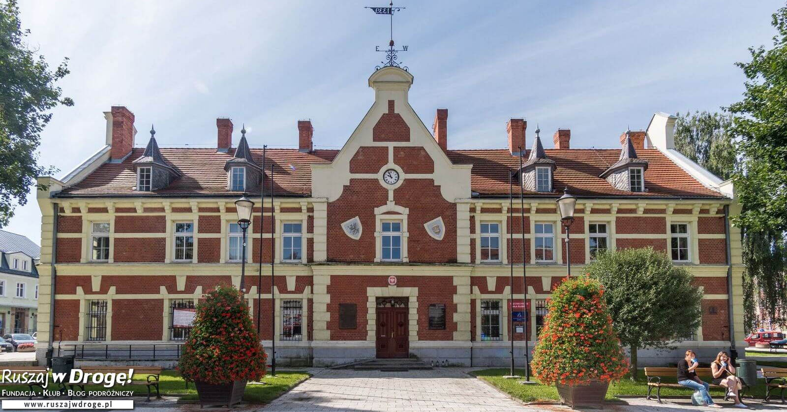

= **_Witajcie w Starogardzie Gdańskim!!!_**

== Wazne linki:

* [x] <https://starogard.pl>

* [x] <http://www.kociewiak.pl>

* [x] <http://starogardgdanski.naszemiasto.pl>

== Podstawowe informacje:

** Wysokosc - 99 m n.p.m.

** Powierzchnia - 25,28 km2.

== Ludność Starogardu w liczbach:

|===
| Wyszczególnienie	|  na dzień 30 VI 2017
| Ludność ogółem	| 44 849
| gestosc zaludnienia | 1910,9 os./km2
|===
